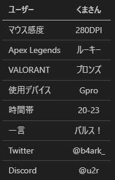

# 今後追加したい機能
構想段階で夢を語ってるだけにすぎませんが、ゲームをやってる人なら絶対欲しいサービスに違いないです。保証します。
とりあえず欲望のままに語ってます。
ここに書いてある案は全て6年前の僕が「作りたいけど無理だー」となっていたやつです。
つまるところ、僕の頭の中も世の中もそんなに変わってないってことです。
## Zerda.jp-ゲーマー向け自己紹介カード
まずはかっこいいホームページが必要ですよね。

フロントはNext.jsで作ります。particle.jsみたいなイケてるエフェクトあるといいかも。
それぞれのサービスへの銅線も作ります。（基本的にはヘッダーに追加するだけになるかも）

Googleアカウント、Discordを使用した、OAuth2.0のみの実装です。フォロー機能も欲しいですね！

後述するDocs.zerda**以外の全ての機能**で得た感度や戦績、使用デバイスなどの情報をユーザーごとに表示させ、一つのプロフィールのようなふるまいを目指します。

例えば

のように情報を一元管理することが目標です。それぞれのデータは本家大本のAPIから取得したいところですが、出来る限りZerdaのそれぞれの機能で取得した値を表示させたいです。

どんなゲームやってるのー？戦績はー？毎回自己紹介カード作るのめんどくさい！

そんな悩みを解決したい。

（僕の悩みは、ログイン機能は技術的になるべくZerda.jpだけにしたいけど、感度を保存したりその情報を取得するなら全てにログイン機能つける必要あるなーと思って困ってます。あと、それぞれのゲームへのログイン認証をつけないと、ほかの人のアカウントを自分のところに登録して簡単になり済ませちゃうのはどうにかしないとだめですね。とは言えなりすましたところでって感じもしますけどねー）
## Docs.zerda-ZerdaにあるサービスのWiKi
これはもう今まさに見てるこれです。
Zerda.jpに存在するサービスの解説を詰め込みます。
何か困ったらとりあえずこれを見ておけば解決するスーパーZerda Wikiを作りたい。とりあえずコンテンツ増えたら検索機能はつけておきます。

## Sens.zerda-マウス感度計算ツール
すでに公開してはいる([これ](https://sens.zerda.jp/))けど、なーんか見た目も悪いし機能がシンプルすぎる。（それがいいのかもだけど）
**あと何と言っても名前を変えたい!!**なんですかSensってSenseにすればいいものを当時高一の私は「短い方がかっこいい！」というってだけで...
ログイン機能をつけて、自分の感度を保存出来るようにする。
全ての人の感度の統計を取り、わかりやすくグラフなどにして表示させる。面白いこといっぱいできそう。

## Tracker.zerda-戦績トラッカーツール
戦績トラッカーサイトはもうすでにたーくさん存在しているので、正直作る必要ないとは思いますが、理由を挙げるならばロマンです。作ってみたいんです！！！しーっかり日本人向けの使いやすい戦績トラッカーを！
そして上のZerda.jpと連携させて、より見やすく自分をアピールしやすい環境を作りたい。
## Guide.zerda-ゲーマー向けナレッジシェアサイト
ビジネスよりのNote、技術よりのZenn、ときたらゲームよりのGuide.zerdaでしょう！(サービス名は考えないとだ)

上のZerda.jpアカウントとはリンクされた状態になっているので、誰が書いた記事なのかが丸わかりなのでGoodです。プロゲーマーやストリーマー、ランクの高い方の記事であれば信頼度も上がりますね！（ただそれにはなりすまし防止が必要だ...）

Noteのように投げ銭機能などがあるといいね。

## Coach.zerda-コーチングマッチングサイト
これはボツです。そこそこ大きなサービスが出来てしまったので、ひっくり返すのは困難であろうということで。あとは直接お金が絡んでくるので、セキュリティ的にもなるべく作りたくはないですしね。
それにしても自分を褒めたい。まあ、結局アイディアだけあっても形にしないと無いようなもんですからね。負けです負け。